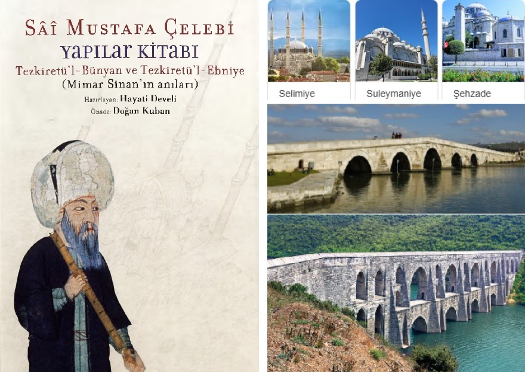

## Sinan olabilmek...

_Tezkiretul-Bunyân_, Mimar Sinan’ın hayatını anlatan ilginç bir kitap.
Edebiyat ile mühendisliğin benzersiz bir karışımı olan bu eser 1586'da 
Sâî Mustafa Çelebi isimli az bilinen bir söz ustası tarafından yazılmış.
40 dakikalık bu sunumda Sinan'ın gayret ve dua ile başarı kazanan
insani yönü vurgulanıyor. 

### 26 Kasım 2020 20:30 Istanbul
M Akif Eyler, 
[Zoom linki](https://fsm-edu-tr.zoom.us/j/95633751389?pwd=RE5UdGVpNXN0aCt4UU9CbkxCeXpGZz09)  
ID: 956 3375 1389  Passcode: 112233

