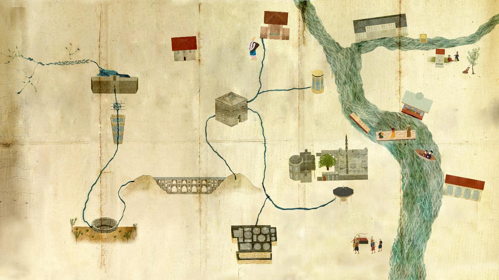
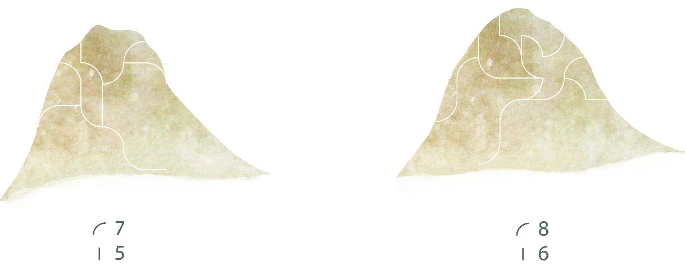
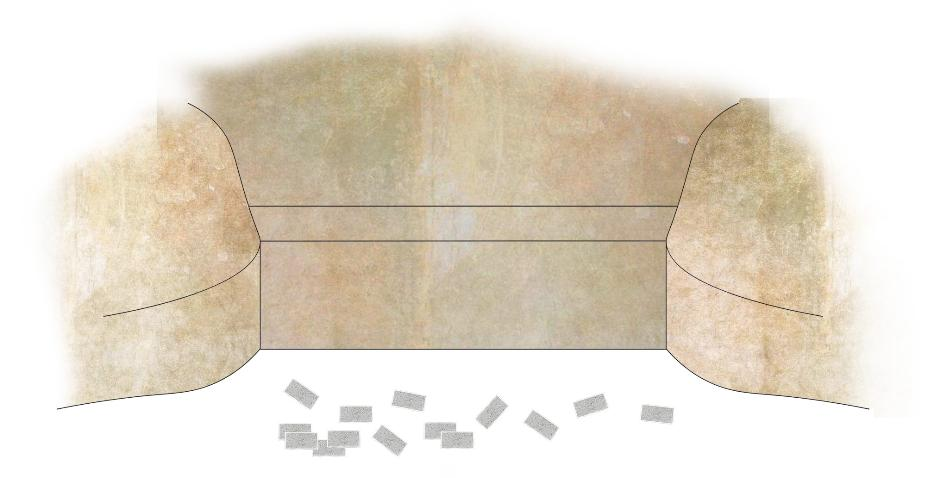
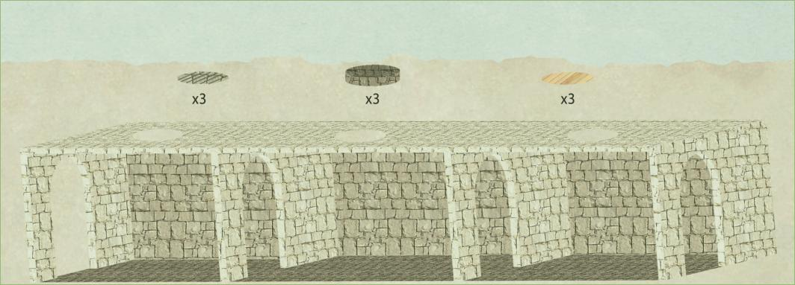
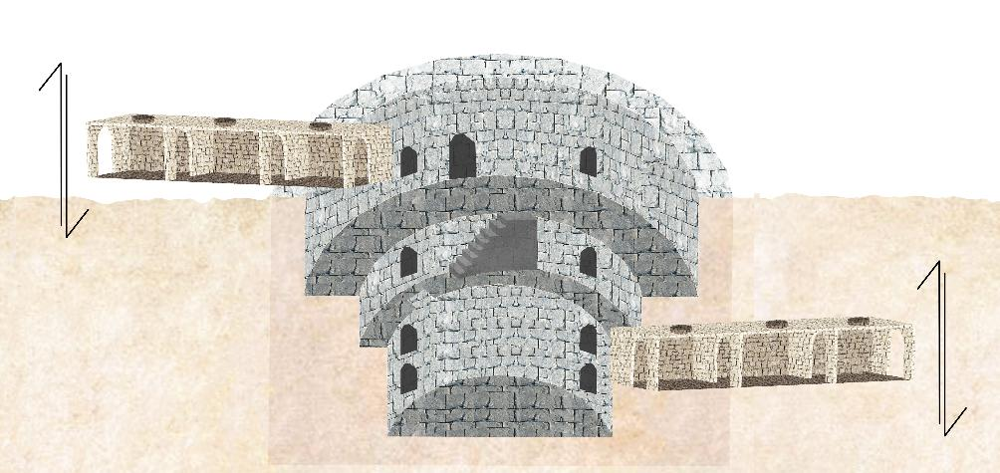
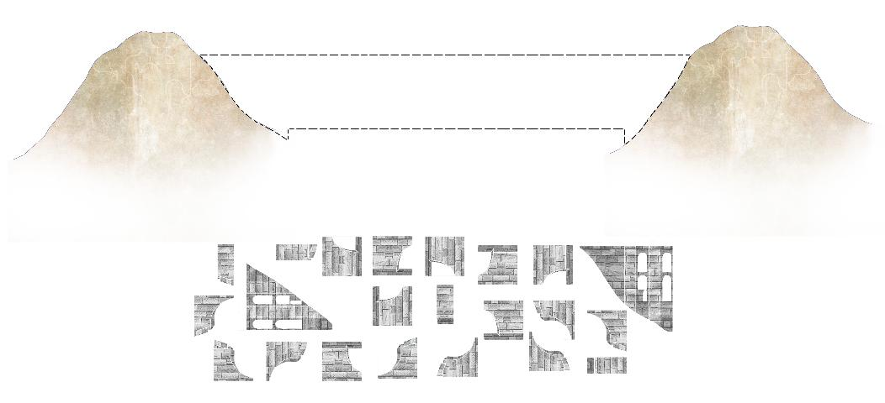
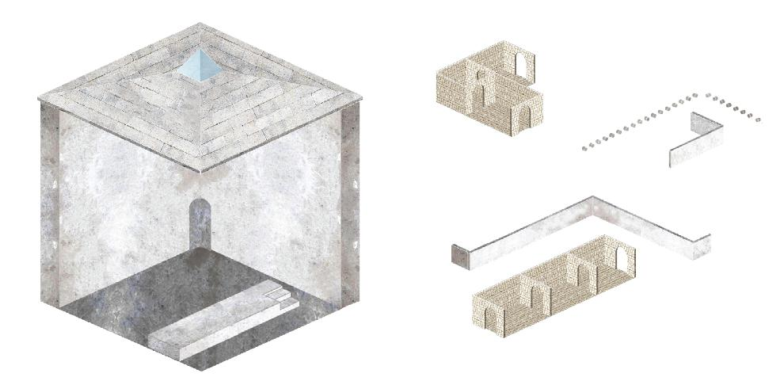
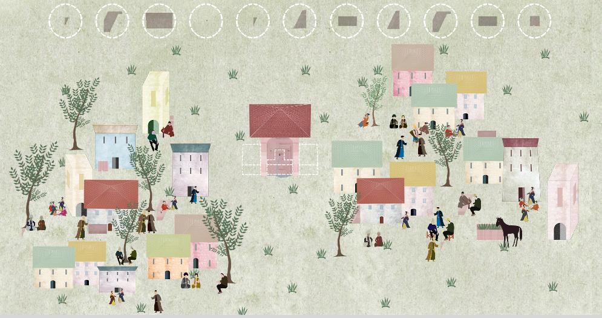
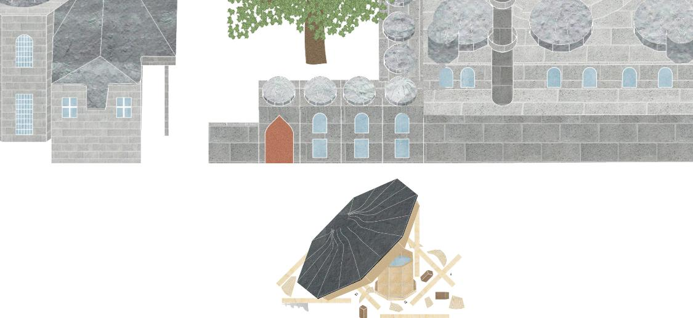
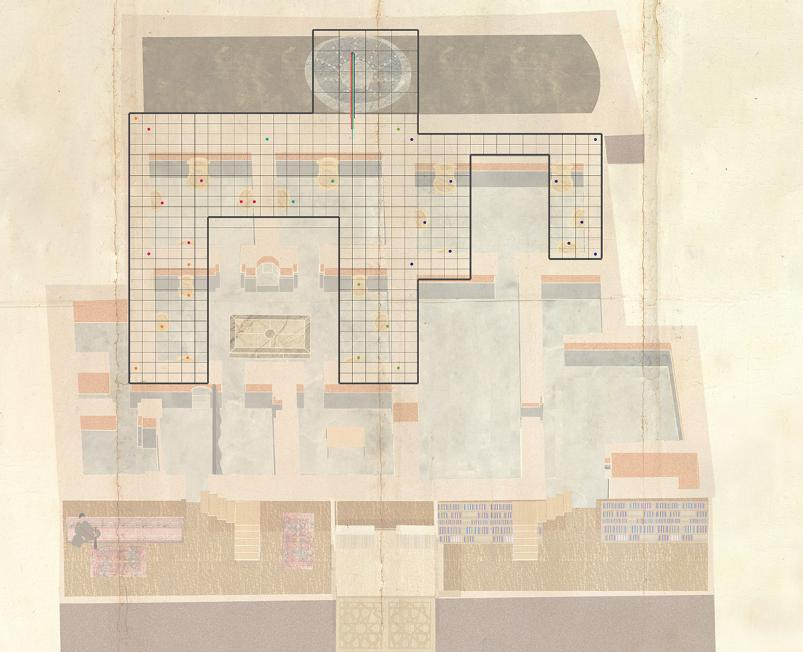

## Su Yolu

Su kültürümüzü yeni nesillere aktaran [bir oyun](index) yapıyoruz



İstanbul'un su yollarını gösteren bu haritada oyunun aşamaları izlenebilir

### 1. havza


### 2. bent


### 3. galeri


### 4. havuz


### 5. kemer


### 6. maksem


### 7. çeşme


### 8. şadırvan


### 9. hamam


### Su Müzesi


```
(C) 2019 by Yoğunluk, Istanbul
Visual material by Edanur Köşeli
```
